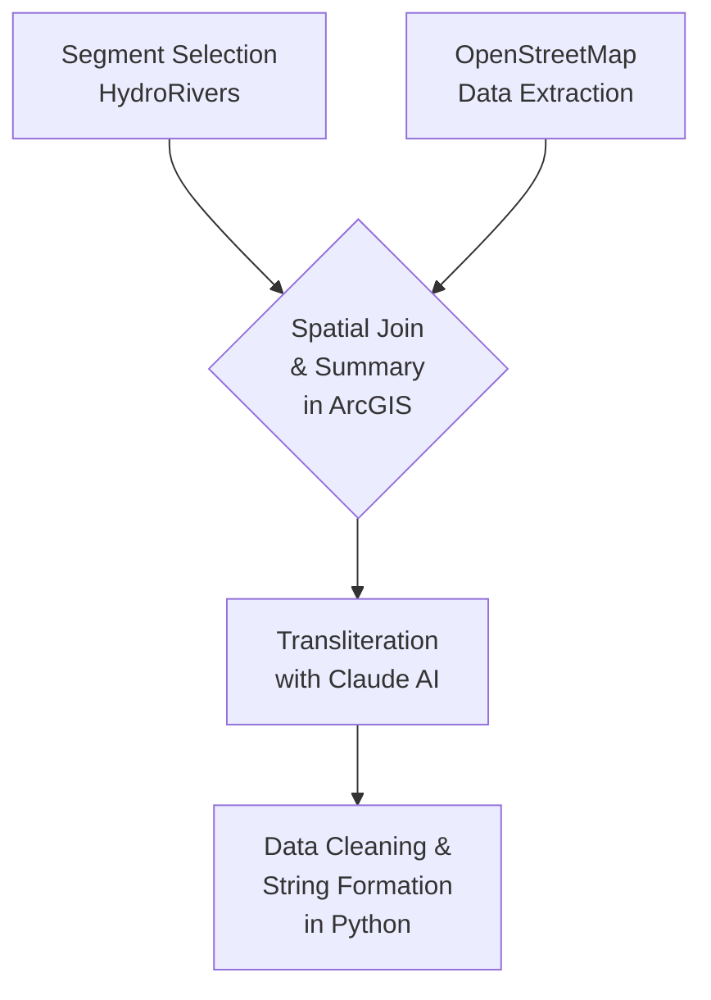

```mermaid
flowchart TD
    A[Segment Selection<br/>HydroRivers] --> C{Spatial Join<br/>& Summary<br/>in ArcGIS}
    B[OpenStreetMap<br/>Data Extraction] --> C
    C --> D[Transliteration<br/>with Claude AI]
    D --> E[Data Cleaning &<br/>String Formation<br/>in Python]
```